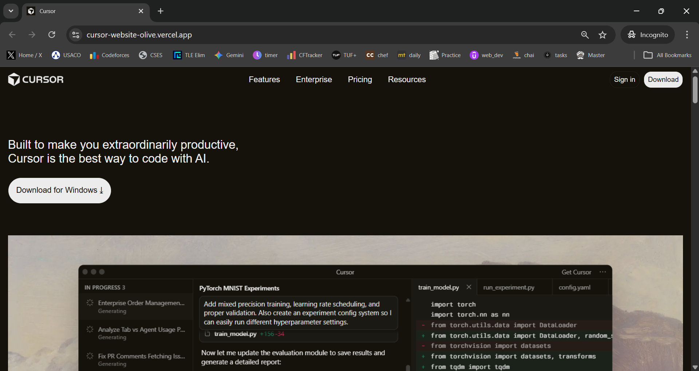
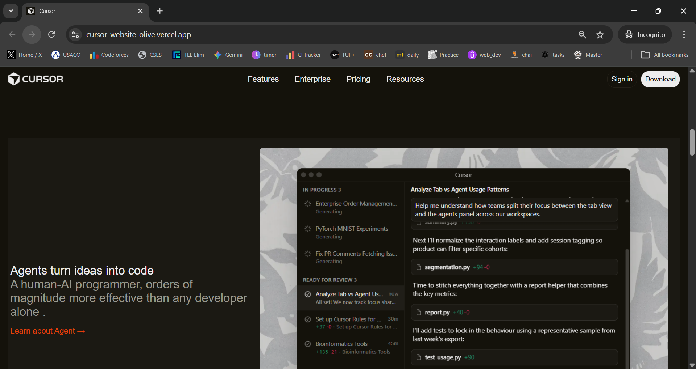
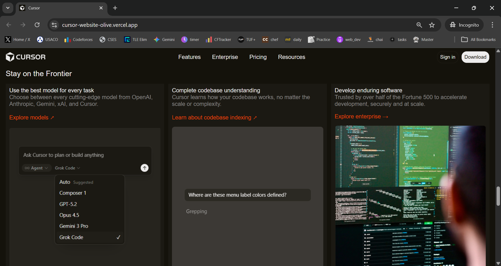
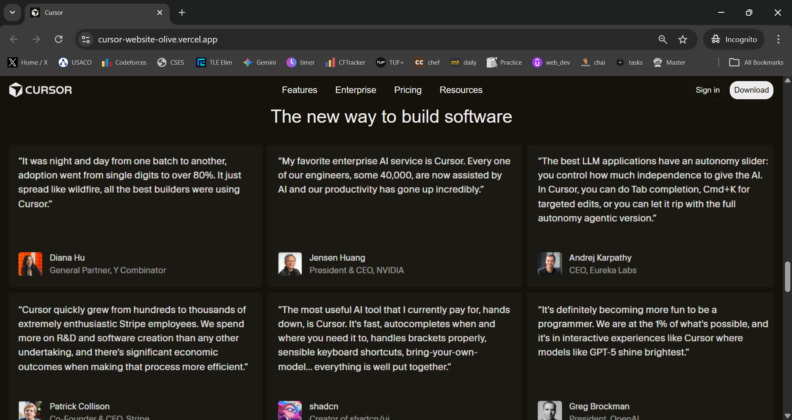
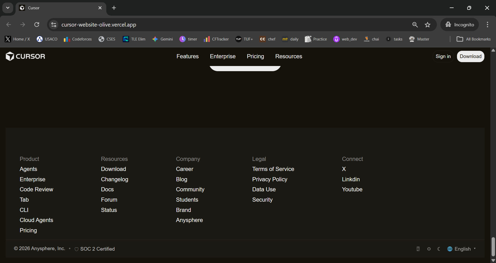

# Cursor Landing Page Clone

A frontend project recreating the design and structure of the Cursor AI landing page using **pure HTML and CSS**.  
This project demonstrates a strong understanding of modern SaaS UI layouts, clean styling practices, and real-world website structure without using any frameworks or libraries.

The focus of this project was to build a production-style landing page while maintaining visual consistency, responsiveness, and reusable components.

---
## Live Demo

🔗 https://cursor-website-olive.vercel.app/

## UI Preview

<p align="center">
  
</p>

<p align="center">
  
</p>

<p align="center">
  
</p>
<p align="center">
  
</p>
<p align="center">
  
</p>


## Key Highlights

- Built entirely with **HTML5 and CSS3**
- No frameworks or external libraries used
- Implemented **CSS Grid and Flexbox** for layout design
- Used **CSS variables** for consistent theming
- Designed reusable UI components (cards, buttons, sections)
- Implemented hover states for better user interaction
- Handled responsive images without layout overflow
- Clean, readable, and maintainable CSS structure

---

## Sections Recreated

The following major sections of the Cursor website were recreated:

- **Fixed Navigation Bar**
  - Logo
  - Feature, Enterprise, Pricing, and Resources links
  - Sign in and Download buttons

- **Hero Section**
  - Marketing headline
  - Call-to-action download button
  - Full-width responsive hero image

- **Trust & Social Proof Section**
  - “Trusted by millions of developers” messaging
  - Supporting visuals

- **Feature Highlight Sections**
  - Text–image split layouts
  - Alternating left/right content structure
  - Feature descriptions with visuals

- **Product Value Section**
  - “The new way to build software” headline
  - Large visual showcase

- **Card-Based Feature Section**
  - Reusable cards highlighting:
    - Model selection
    - Codebase understanding
    - Enterprise reliability

- **Changelog Section**
  - Update cards with hover effects
  - Timeline-style layout

- **Final Call-to-Action Section**
  - Download prompt
  - Conversion-focused layout

- **Footer Section**
  - Multi-column footer
  - Product, Resources, Company, and Legal links
  - Branding and certification details

---

## Fonts Used

- **Font Stack:**  
  `Arial, Helvetica, sans-serif`

This system font stack was chosen to ensure:
- A clean and modern SaaS look
- High performance and fast loading
- Cross-platform consistency and readability

---

## Color Palette

The project uses CSS variables to maintain a consistent theme:

```css
:root {
  --bg-color: #14120b;
  --text-color: #edecec;
  --hover-color: #d7d6d5;
}
